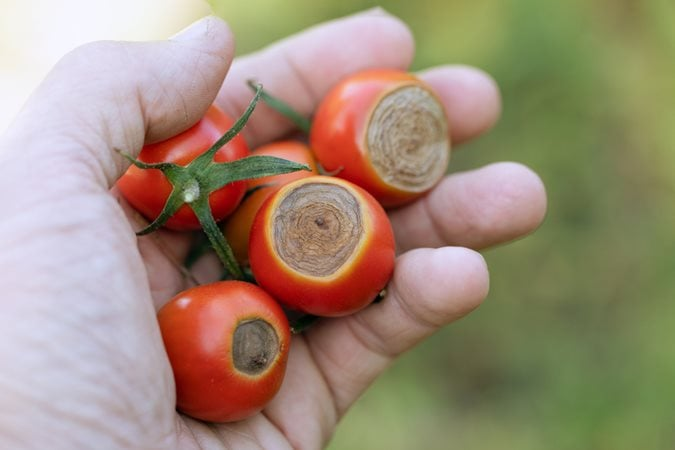
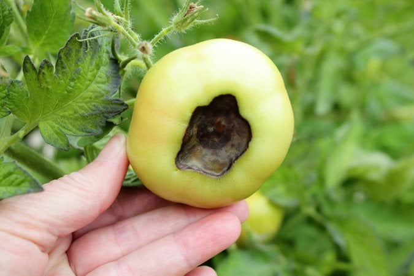

# KrushiMitra Project

Complete code implementation of the KrushiMitra AI-powered agricultural assistance platform.

## Demo Links

- **YouTube Demo**: https://youtu.be/qeAC5Sxf1Mo
- **Live Application**: https://krushimitra-kohl.vercel.app/

`(please open it in your smartphone it really looks beautiful)`

- **Vector Database Dashboard**: https://kishancallvectordb-816972702925.asia-south1.run.app/
- **Documentation**: https://github.com/Gyana491/krushimitra-ai-agent

My email id : gyanaranjanmohanta2004@gmail.com

before you proceed for testing know about our agentic tools :

`kccdatabaseTool` = Kishan Call center vectorDB

- used as knowledge source using RAG implementation
- currently we have trained it based on Odisha call center database 2024-2025
- To make it adoptable to more states we don't need retrain the model, we just have to ingest the data in our kishacall vectordb tool

`mandipricetool` = Querying Mandi Price From data.gov.in

- some states and districts don't have mandi price index but if it's a popular city then mandi price work properly

`weatherTool` = to get information about the weather forecast of the the current user.

`webSearchTool` = To pull the most recent information from the internet.

- We implemented it because the data from the government data source is very in consistent.
- our main motto is to provide the most accurate answer to the farmer.
- web search is tool is used to verify all the facts and and prove the response according to most recent events.

`UserContext` = To understand the Farmers context before giving the answer.

- Farmers are not the mostly educated one. so they can't express the queries properly
- User Context tool always updates and runs inthe background. to gather context such as farme size, farm location, crops, username, current weather.

`VoiceInput` = Our Voice Input can detect all 30 languages in india. powered by india's `sarvam ai`

- I have implemented it because I have seen how mother and father use  `voice search` for youtube and google.

`AIsuggestedQueries` = This is implemented to increase the farmers curiosity to ask more questionsand provide more information about the queries. means farmers don't have to type everytime,

- The Suggested queries are shown based on farmers past conversation history, and weather and location and farmers context.

When all these tools combined, they the information are gathered form verified data sources then,

we provide the most accurate answer to the farmer.

and that's the main motto of `KrushiMitra`

I know it can provide a lot of value to the farmers. infact, my father is a farmer he has been using it since I built it.

I want every farmer in india use `KrushiMitra`.
but I can't afford to continue this project and provide it free to all farmers in india.

if I receive some encouragement and support from you, I can definitely give 100% to make it accessible to every farmer in india.
and try to approach the government for funding support to make it sustainable.

Also I am integrating more features like:

- Fertilizer Calculator
- Make the UI more intuitive and simple and accessible
- KrushiMitra speech to speech Farming advisor
- AI powered crop yield calculator
- personalised weather alert system with actionable advice
- and a marketplace for farmers to trade
- Building a community for farmers.

To make `KrushiMitra` the ultimate farmer companion to grow their yield.

If I recieved any funding support from you. I will invest all that money to create educational content on YouTube,Instagram, Facebook.

To educate the farmers about smart farming techniques, and profitable tips in all regional languages.

and generating a sustainable strategy for Krushimitra.

To make a sustainable community of Farmers.

to ultimate goal is to `make every farmer a smart farmer` , through agentic ai and educating farmers

## Testing Queries

The following queries are designed to test various capabilities of the KrushiMitra AI Agent. These queries simulate real farmer interactions and cover multiple agricultural domains.

I recommend some from odisha to test the queries in Odia Languages.

(Please try Voice Input in Odia Languages)

Please choose any location in Odisha. Ex: Banki. Odisha

Also Try Image Input To detect  the Crop Diseases and get actionable advices

## Sample Images for Testing Disease Detection

You can use these sample images to test the AI-powered crop disease detection feature:

### Tomato Anthracnose Disease


*Upload this image to test detection of anthracnose disease in tomatoes. The AI should identify the disease and provide treatment recommendations.*

### General Crop Disease Sample


*Upload this image to test general disease detection capabilities and get actionable advice for treatment.*

### How to Test Image Upload Feature

1. **Navigate to the KrushiMitra application**
2. **Click on the image upload button** or camera icon
3. **Upload one of the sample images** from the `images/Readme/` folder
4. **Wait for AI analysis** and receive disease identification
5. **Get actionable treatment advice** and preventive measures

The AI will analyze the uploaded images and provide:
- Disease identification
- Severity assessment
- Treatment recommendations
- Preventive measures
- Cost-effective solutions

## Weather-Related Queries

```
Will it rain in the next 3 days? 
```

```
Is there a heatwave this week? How will it affect my crop?
```

```
What is the best time to plant rice ?
```

```
Any risk of heavy rain or flooding in the next few days?
```

```
ଧାନ ଗଛରୁ ଧାନ ବିଲରୁ ଆମେ ବାଳୁଙ୍ଗା କେମିତି ଅଲଗା କରିପାରିବା ଆଉ ଘାସ ବାଛିବା ପାଇଁ ସବୁଠୁ ବେଷ୍ଟ ଟାଇମ କେବେ ଏଇ 10 ଦିନ ଭିତରେ କେବେ ଘାସ ବାଛିବା ଟା ଭଲ ହବ
```

## Subsidies, Schemes and Loans Queries

```
What subsidies can I get for drip irrigation on my 2-acre rice farm?
```

```
Am I eligible for Kisan Credit Card? What documents do I need?
```

```
When is the next PM-KISAN installment? How do I check my beneficiary status?
```

```
What subsidies are available for seeds and fertilizers for my paddy crop?
```

```
Can I get a subsidy for buying a power tiller?
```

## General Government Schemes Queries

```
What schemes am I eligible for based on my farm size and crops?
```

```
Kalia Yojana Complete details
```

```
What are Some Government schemes for farmers in Odisha?
```

## Market Price and Trading Queries

```
price in odisha What's today's paddy rate in nearby mandis?
```

```
Tomato price today in cuttack? Should I sell now or wait?
```

```
List all Mandi Prices in Cuttack district today
```

```
Tomato prices - which mandi is better today? near me
```

```
Tomato Price in all mandis in odisha
```

```
What's the groundnut price today?
```

```
Where to sell my rice for better prices 
```

## Crop and Farming Queries

```
What is the best time to plant Rice this season?
```

```
Which Rice  varieties suits my land ?
```

```
How to Remove Weed from my rice crop ? When is the right time to do it ? There are a lot of weeds in my rice field. I don't have labours  to work on . suggest me how to remove them.
```

```
My paddy leaves are yellow. What should I do?
```

```
When is the right time to harvest my paddy?
```

```
How do I improve soil health in my farm?
```

```
Which crops are profitable this season in my location?
```

```
What is the cost of cultivation for paddy?
```

## How to Use These Queries

1. **Copy and paste** any query from the code blocks above
2. **Test different categories** to evaluate various AI capabilities
3. **Mix and match** queries to simulate real farming scenarios
4. **Modify location/crop details** as needed for your specific testing requirements

Each query is formatted in its own code block for easy copying and pasting into the KrushiMitra AI interface.
